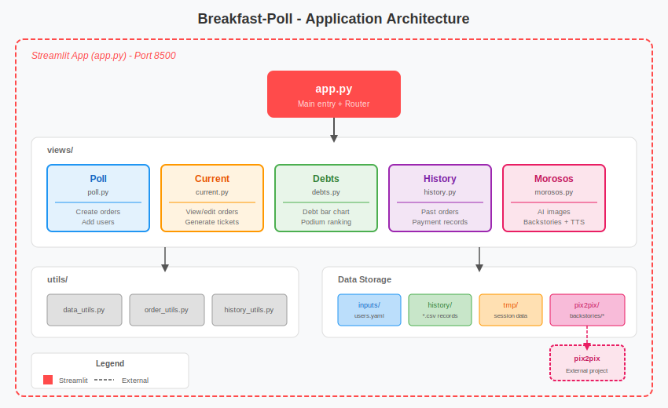
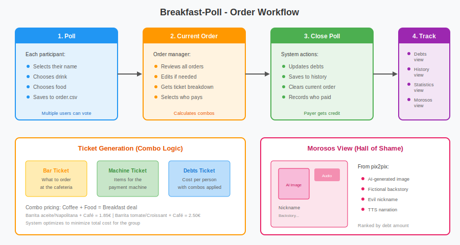

# Breakfast-Poll

A Streamlit-based coffee and breakfast ordering system for GTI (Grupo de Tratamiento de Imágenes). Allows team members to place orders, tracks who owes coffee, calculates optimized combo pricing, and displays a "Hall of Shame" with AI-generated content for debtors.

## Architecture



## Workflow



## Features

### Poll
- Team members select their name, drink, and food
- Supports various drinks (coffee, tea, colacao) and foods (barritas, napolitanas, croissants, etc.)
- Orders are saved incrementally as users vote
- New users can be added on the fly with optional starting debt

### Current Order
- View all orders for the current round
- Edit/remove entries before closing
- **Smart ticket generation**:
  - **Bar Ticket**: What to order at the cafeteria
  - **Machine Ticket**: Optimized items for the payment terminal (applies breakfast combos)
  - **Debts Ticket**: Per-person cost with combo discounts applied
- Select who pays and close the poll

### Debts
- Interactive horizontal bar chart with red-to-green color gradient
- Red for debt, white for zero, green for overpayment/credit
- Podium ranking (gold/silver/bronze for top debtors)
- Positive = owes money, Negative = has credit

### History
- Browse past orders in reverse chronological order
- View who paid, what was ordered, and individual costs

### Statistics
- Comprehensive analytics dashboard with interactive Plotly visualizations
- **Filters**: Date range, users, drinks, and foods with context-aware filtering
- **Spending Over Time**: Line charts showing daily spending trends (includes zero-value days)
- **Participation Count**: Bar chart tracking number of orders per day
- **Item Popularity**: Horizontal bar charts for most popular drinks and foods
- **User Activity**: Participation frequency with dynamic chart heights
- **Who Pays**: Payment frequency and total amounts paid by each person with podium
- **Accumulated Debt Evolution**: Line chart showing debt balance over time
- **Summary Metrics**: Total sessions, orders, spending, and average per session
- Consistent color mapping for users across multiple charts

### Morosos (Hall of Shame)
- Displays all team members ranked by debt
- Shows AI-generated content from [pix2pix](../pix2pix):
  - Funny AI-generated images (Stable Diffusion 3.5)
  - Fictional "evil debtor" backstories
  - Villain nicknames
  - Text-to-speech narration of backstories

## Project Structure

```
Breakfast-Poll/
├── app.py                 # Main Streamlit app and router
├── views/
│   ├── poll.py            # Order creation view
│   ├── current.py         # Current order management
│   ├── debts.py           # Debt visualization
│   ├── history.py         # Past orders browser
│   ├── statistics.py      # Analytics dashboard
│   └── morosos.py         # Hall of shame with AI content
├── utils/
│   ├── data_utils.py      # YAML/CSV loading, user management
│   ├── order_utils.py     # Order logic, combo calculations
│   └── history_utils.py   # History file management
├── inputs/
│   └── users.yaml         # User list
├── history/               # Saved order records (generated)
├── tmp/                   # Session data (generated)
└── assets/                # Documentation images
```

## Combo Pricing Logic

The system optimizes breakfast combos to minimize total cost:

| Combo | Items | Price |
|-------|-------|-------|
| Breakfast A | Café + Barrita aceite/Napolitana | 1.85€ |
| Breakfast B | Café + Barrita tomate/Croissant | 2.50€ |
| Infusion combo | Té/Manzanilla + Food | Discounted |

When there are more combo-eligible food items than coffees, the system intelligently distributes costs among participants.

## Requirements

- Python 3.10+
- Streamlit
- pandas, plotly, matplotlib, seaborn
- Access to `pix2pix/backstories/` for the Morosos view

## Installation

```bash
# Create virtual environment
python -m venv venv
source venv/bin/activate

# Install dependencies
pip install -r requirements.txt
```

## Usage

```bash
# Activate virtual environment
source venv/bin/activate

# Run the app
streamlit run app.py --server.port 8500
```

Or simply run:
```bash
python app.py
```

The app will be available at `http://localhost:8500`

### Production Deployment

The app is configured to run at:
- **URL**: `www.gti.ssr.upm.es/cafe`
- **Port**: 8500

## Related Projects

- **[pix2pix](../pix2pix)** - Generates AI images and backstories for the Morosos view
- **[coqui-ai-TTS](../coqui-ai-TTS)** - Text-to-speech for backstory narration
